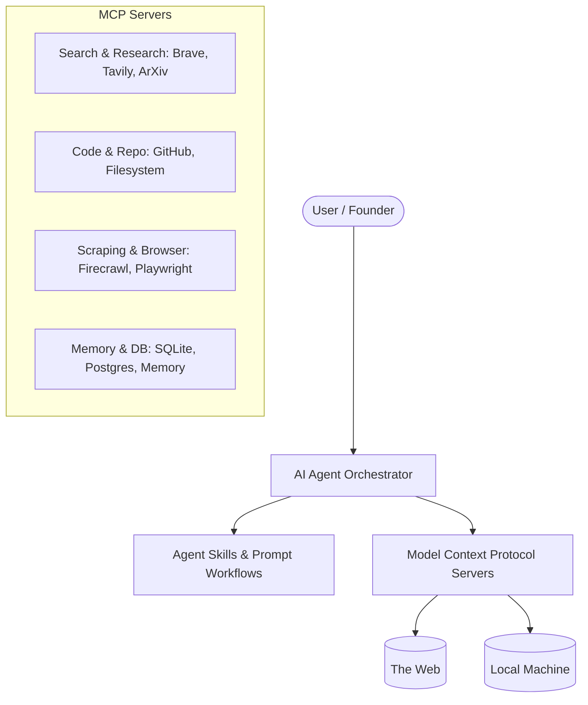

# AI Research Environment Architecture

Welcome to the autonomous startup research and venture capital due diligence environment. This environment is designed to augment an AI agent with deep research capabilities, memory, code execution, and data analysis using the Model Context Protocol (MCP).

## 🏗️ High-Level Architecture

The environment relies on three primary pillars:

1. **The Orchestrator (AI Agent)**: Handles reasoning, planning, and executing tools.
2. **MCP Servers**: Standardized interfaces connecting the AI to local resources (like files and databases) and external web services (like APIs, search engines, and scrapers).
3. **Skills & Guidelines**: System prompts and workflows that guide the AI on *how* to perform specific tasks, like evaluating a startup's business model or auditing software architecture.

## 🚀 Key Capabilities Enabled

By setting up this environment, the AI gains the following super-powers:

### 1. Deep Web Research & Market Intelligence
Instead of basic web searches, the agent can use **Tavily** for optimized AI search, **Brave Search** for unfiltered results, and **Firecrawl** to scrape entire competitor websites into Markdown for deep analysis.

### 2. Autonomous Due Diligence & Code Review
The **GitHub** and **Filesystem** MCP servers allow the AI to clone a startup's repository, read the code, analyze the architecture, and generate threat models or technical debt reports.

### 3. Long-Term Memory & Context
The **Memory** and **Sequential Thinking** MCP servers allow the AI to remember facts about your startup across sessions, ensuring context is never lost during long-term projects.

### 4. Technical & Academic Research
Integration with **ArXiv** and **Semantic Scholar** enables the AI to fetch the latest whitepapers, PDF reading skills allow it to parse pitch decks, and Markdown generation allows it to build a local knowledge base.

---
**Next Steps:** Proceed to `TOOLING.md` to install the prerequisites, and then `MCP_SETUP.md` to configure the servers.
